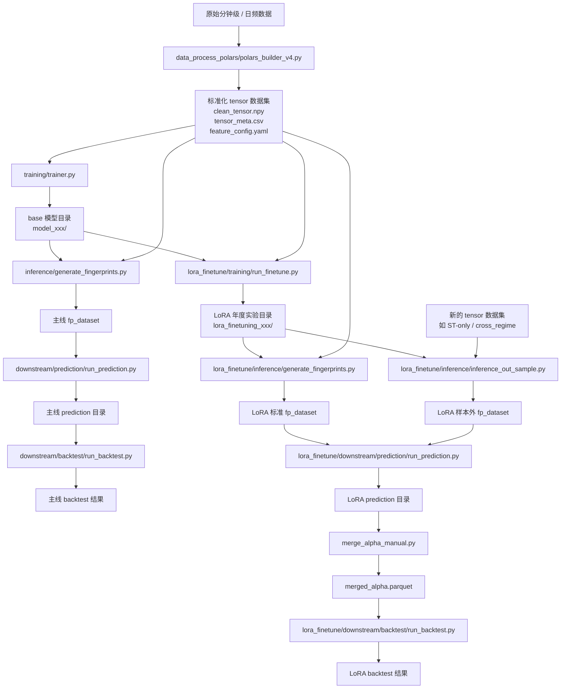

# transformer_pipeline_final 交接说明

这套代码是一条完整的量化研究流水线，核心目标是：

1. 先把原始行情数据加工成标准化 tensor 数据集
2. 训练一个 base encoder 模型
3. 用 encoder 生成 fingerprint
4. 基于 fingerprint 训练下游预测模型
5. 对 alpha 做回测评估

在这条主线之上，又扩展了一条 LoRA 支线，用于：

- 复用主线 base 模型
- 按年份做轻量 LoRA 微调
- 生成年度 LoRA fingerprint
- 做 LoRA 版本的 prediction 和 backtest

---

## 一、先看整体结构

### 1. 主线和支线

这套仓库分成两条线：

- 主线
  - `data_process_polars -> training -> inference -> downstream/prediction -> downstream/backtest`

- 支线（LoRA）
  - `training(base model) -> lora_finetune/training -> lora_finetune/inference -> lora_finetune/downstream/prediction -> lora_finetune/downstream/backtest`

关系上可以理解成：

- 主线负责训练底座模型
- LoRA 支线以主线训练出来的 base 模型为起点
- 两条线都共享 tensor 数据集格式
- 两条线最终都落到 fingerprint、prediction、backtest

---

## 二、目录说明

### 主线目录

- `data_process_polars/`
  - 构建标准化 tensor 数据集
- `training/`
  - 训练 base 模型
- `inference/`
  - 用 base 模型生成 fingerprint
- `downstream/prediction/`
  - 用主线 fingerprint 做预测
- `downstream/backtest/`
  - 对主线 alpha 做回测

### 支线目录

- `lora_finetune/training/`
  - 以 base 模型为起点做年度 LoRA 微调
- `lora_finetune/inference/`
  - 生成 LoRA fingerprint
- `lora_finetune/downstream/prediction/`
  - 用 LoRA fingerprint 做预测
- `lora_finetune/downstream/backtest/`
  - 对 LoRA alpha 做回测

### 共用目录

- `models/`
  - 模型结构定义
- `losses/`
  - 训练损失

---

## 三、整体流程图



---

## 四、主线详细流程

## 1. 数据构建：`data_process_polars/`

核心文件：
- `data_process_polars/builder_config.py`
- `data_process_polars/polars_builder_v4.py`

作用：
- 从分钟级特征 parquet 和日频元数据构建标准化 tensor 数据集
- 生成后续训练统一使用的输入格式

主要输出示例：

```text
/data/lbsun/std_tensor_dataset/tensor_dataset_v4_2021-07-01_2026-03-25_20260520_101500/
├─ clean_tensor.npy
├─ tensor_meta.csv
├─ feature_config.yaml
├─ dropped_nan_samples.csv
└─ dropped_nan_feature_summary.csv
```

关键产物说明：
- `clean_tensor.npy`
  - 训练/推理实际使用的 3D 张量
- `tensor_meta.csv`
  - 每个样本对应的 `(stock, date)`
- `feature_config.yaml`
  - 特征维度定义，后续训练和推理都会依赖它

模块顺序：
1. 读取日频元数据
2. 用 `INCLUDE_FLAGS / EXCLUDE_FLAGS` 筛样本
3. 构建分钟交易骨架
4. 拼接分钟特征
5. 做标准化和缺失处理
6. 输出最终 tensor

---

## 2. 主线训练：`training/`

核心文件：
- `training/trainer_config.py`
- `training/trainer.py`
- `training/dataset.py`

作用：
- 使用标准 tensor 数据集训练 base 模型

关键配置：
- `STD_TENSOR_DIR`
  - 输入的 tensor 数据集目录
- `TRANSFORMER_TRAIN_DATES`
  - 训练日期范围
- `MODEL_TYPE`
  - 当前支持 `transformer_context` / `autoencoder`
- `MODEL_SAVE_DIR`
  - 模型保存目录

输出示例：

```text
/data/lbsun/saved_models/model_4c290c2e_20260416_180500/
├─ config.json
├─ checkpoints/
│  ├─ encoder_best.pt
│  ├─ decoder_best.pt
│  ├─ encoder_last.pt
│  └─ decoder_last.pt
└─ logs/
```

关键产物说明：
- `config.json`
  - 训练快照，主线 inference 会回溯读取
- `encoder_best.pt`
  - 主线 fingerprint 生成常用 checkpoint

运行顺序：
1. 读取 `STD_TENSOR_DIR`
2. 用 `training/dataset.py` 构造 dataloader
3. 初始化模型
4. 训练并保存最优 checkpoint

---

## 3. 主线 fingerprint：`inference/`

核心文件：
- `inference/genfp_config.py`
- `inference/generate_fingerprints.py`

作用：
- 使用 base 模型 encoder 生成 fingerprint

关键配置：
- `MODEL_RUN_DIR`
  - 指向某次主线训练输出目录
- `ENCODER_CKPT_NAME`
  - 常用为 `encoder_best.pt`
- `FINGERPRINT_GEN_DATES`
  - fingerprint 生成区间

输出示例：

```text
/data/lbsun/saved_models/model_4c290c2e_20260416_180500/fp_dataset/
├─ fingerprints.parquet
└─ fingerprint_meta.json
```

模块顺序：
1. 定位 `MODEL_RUN_DIR`
2. 读取训练时的 `config.json`
3. 找到对应 encoder checkpoint
4. 回溯训练使用的 tensor 数据集
5. 生成 fingerprint

---

## 4. 主线 prediction：`downstream/prediction/`

核心文件：
- `downstream/prediction/predict_config.py`
- `downstream/prediction/run_prediction.py`

作用：
- 从 fingerprint 构造下游监督任务
- 训练 GRU
- 输出 alpha

关键配置：
- `model_run_dir`
  - 需要读取哪个模型目录下的 `fp_dataset`
- `fingerprint_subdir`
  - 默认是 `fp_dataset`
- `horizon`
  - 收益 horizon
- `seq_len`
  - GRU 序列长度

输出示例：

```text
downstream/run/ComplexGRUAlpha_ohlcv_5D_20260520_103000/
├─ predict_config.json
├─ alpha.parquet
├─ ensemble_alpha.parquet
└─ checkpoints/
```

---

## 5. 主线 backtest：`downstream/backtest/`

核心文件：
- `downstream/backtest/backtest_config.py`
- `downstream/backtest/backtest_pipeline.py`
- `downstream/backtest/run_backtest.py`

作用：
- 对 prediction 输出的 alpha 做回测评估

关键配置：
- `prediction_run_dir`
  - 指向某次 prediction 运行目录
- `alpha_file_name`
  - 默认常用 `ensemble_alpha.parquet`
- `horizon`
  - 对应收益周期

新增可配置项：
- `ret_buy_price`
- `ret_sell_price`
- `ret_open_shift`
- `ret_open_limit`
- `ret_benchmarks`

说明：
- 这些字段原来在 `backtest_pipeline.py` 中是硬编码
- 现在已经支持通过配置覆盖

输出示例：

```text
downstream/run/ComplexGRUAlpha_ohlcv_5D_20260520_103000/experiments/backtest_20260520_110000/
├─ backtest_config.json
├─ *_ic_stats.csv
├─ *_rank_ic_stats.csv
├─ *_long_short_stats.csv
└─ *_evaluation_charts.png
```

---

## 五、LoRA 支线详细流程

LoRA 支线依赖主线训练出的 base 模型。

## 1. LoRA 年度微调：`lora_finetune/training/`

作用：
- 以主线 base 模型为起点
- 按年份做 LoRA 微调

输出示例：

```text
/data/lbsun/saved_models/lora_finetuning_model_xxx/
├─ finetune_manifest.json
├─ lora_2024_20260512_101500/
│  ├─ config.json
│  └─ checkpoints/
│     ├─ encoder_lora_best.pt
│     └─ encoder_lora_last.pt
├─ lora_2025_20260512_142300/
└─ lora_2026_20260512_173800/
```

关键产物：
- `finetune_manifest.json`
  - 后续 LoRA inference 必须依赖它

---

## 2. LoRA 标准 fingerprint：`lora_finetune/inference/generate_fingerprints.py`

作用：
- 使用年度 LoRA encoder
- 对原训练数据集生成年度 fingerprint

输出示例：

```text
/data/lbsun/saved_models/lora_finetuning_model_xxx/fp_dataset/
├─ fingerprints_2024.parquet
├─ fingerprints_deploy_2024.parquet
├─ fingerprints_2025.parquet
├─ fingerprints_deploy_2025.parquet
├─ fingerprints_2026.parquet
├─ fingerprints_deploy_2026.parquet
├─ fingerprints_merged.parquet
└─ fingerprint_manifest.json
```

---

## 3. LoRA 样本外 fingerprint：`lora_finetune/inference/inference_out_sample.py`

作用：
- 不重新训练 LoRA
- 直接复用旧 LoRA 权重
- 改吃新的 tensor 数据集，比如 ST-only 数据集

输出示例：

```text
/data/lbsun/saved_models/lora_finetuning_model_xxx/fp_dataset_st_cross_regime/
├─ fingerprints_2024.parquet
├─ fingerprints_deploy_2024.parquet
├─ fingerprints_2025.parquet
├─ fingerprints_deploy_2025.parquet
├─ fingerprints_2026.parquet
├─ fingerprints_deploy_2026.parquet
├─ fingerprints_merged.parquet
└─ fingerprint_manifest.json
```

---

## 4. LoRA prediction：`lora_finetune/downstream/prediction/`

作用：
- 使用 LoRA fingerprint 做年度滚动预测
- 年度 alpha 生成后，当前默认通过 `merge_alpha_manual.py` 手工指定路径合并

输出示例：

```text
/data/lbsun/saved_models/lora_finetuning_model_xxx/prediction/
├─ ComplexGRUAlphaLoRA_seq20_hrz20_2024_20260520_140500/
├─ ComplexGRUAlphaLoRA_seq20_hrz20_2025_20260520_145200/
├─ ComplexGRUAlphaLoRA_seq20_hrz20_2026_20260520_151000/
├─ prediction_manifest.json
├─ merged_alpha.parquet
└─ alpha_merge_manifest.json
```

当前 merge 方式说明：

- 默认使用 `lora_finetune/downstream/prediction/merge_alpha_manual.py`
- 需要手动填写 `ALPHA_PATHS`
- 需要手动指定 `OUTPUT_DIR`
- `merge_alpha.py` 仍然保留，但当前不是默认工作流

实际使用建议：

- 如果后续采用 `merge_alpha_manual.py` 手工合并 yearly alpha
- 那么 `lora_finetune/downstream/prediction/predict_config.py` 里的 `target_year`
  建议逐年填写，例如先跑 `2024`，再跑 `2025`，再跑 `2026`
- 不建议直接把 `target_year=None` 一次性全跑完后再手工筛选
- 这样更方便控制每一年的实验结果、排查问题和手工挑选要合并的 alpha

---

## 5. LoRA backtest：`lora_finetune/downstream/backtest/`

作用：
- 对 LoRA prediction 输出的合并 alpha 做回测

说明：
- LoRA backtest 入口已经和主线路径解耦
- 但回测引擎仍复用主线 `downstream/backtest/backtest_pipeline.py`
- 现在关键回测参数已经支持在 LoRA 自己的 `backtest_config.py` 中配置，不需要再去主线代码里改硬编码

LoRA backtest 里可直接配置：
- `ret_buy_price`
- `ret_sell_price`
- `ret_open_shift`
- `ret_open_limit`
- `ret_benchmarks`

输出示例：

```text
/data/lbsun/saved_models/lora_finetuning_model_xxx/backtest/backtest_lora_20260520_160000/
├─ backtest_config.json
├─ *_ic_stats.csv
├─ *_rank_ic_stats.csv
├─ *_long_short_stats.csv
└─ *_evaluation_charts.png
```

---

## 六、模块顺序速查

### 主线顺序

1. `data_process_polars/polars_builder_v4.py`
2. `training/trainer.py`
3. `inference/generate_fingerprints.py`
4. `downstream/prediction/run_prediction.py`
5. `downstream/backtest/run_backtest.py`

### LoRA 标准顺序

1. `training/trainer.py`
2. `lora_finetune/training/run_finetune.py`
3. `lora_finetune/inference/generate_fingerprints.py`
4. `lora_finetune/downstream/prediction/run_prediction.py`
5. `lora_finetune/downstream/prediction/merge_alpha_manual.py`
6. `lora_finetune/downstream/backtest/run_backtest.py`

### LoRA 样本外顺序

1. `training/trainer.py`
2. `lora_finetune/training/run_finetune.py`
3. `lora_finetune/inference/inference_out_sample.py`
4. `lora_finetune/downstream/prediction/run_prediction.py`
5. `lora_finetune/downstream/prediction/merge_alpha_manual.py`
6. `lora_finetune/downstream/backtest/run_backtest.py`

---

## 七、建议先看哪些文件

如果是新接手同学，建议按下面顺序读：

1. 先看本 README，建立全局认识
2. 看 `data_process_polars/polars_builder_v4.py`，理解数据怎么构造
3. 看 `training/trainer_config.py` 和 `training/trainer.py`，理解 base 模型怎么训练
4. 看 `inference/generate_fingerprints.py`，理解 fingerprint 怎么生成
5. 看 `downstream/prediction/` 和 `downstream/backtest/`
6. 最后看 `lora_finetune/README.md` 和 LoRA 子模块

---

## 八、模型目录命名说明

当前你在 `/data/lbsun/saved_models` 下常见到的目录大致分为两类：

### 1. 主线 base 模型目录

示例：

- `model_4c290c2e_20260416_180500`

含义：

- `model`
  - 表示这是主线训练出来的 base 模型目录
- `4c290c2e`
  - 由训练配置计算得到的配置哈希，用来区分不同超参数组合
- `20260416_180500`
  - 训练启动时的时间戳

这个目录通常包含：

```text
model_4c290c2e_20260416_180500/
├─ config.json
├─ checkpoints/
│  ├─ encoder_best.pt
│  ├─ decoder_best.pt
│  ├─ encoder_last.pt
│  └─ decoder_last.pt
└─ logs/
```

### 2. LoRA 实验目录

示例：

- `lora_finetuning_model_4c290c2e_20260416_180500`
- `lora_finetuning_model_4c290c2e_20260416_180500_QV_v1`
- `lora_finetuning_model_4c290c2e_20260416_180500_QV_v1_ST`
- `lora_finetuning_model_4c290c2e_20260416_180500_QV_v2_ST`
- `lora_finetuning_model_4c290c2e_20260416_180500_ST`

含义：

- `lora_finetuning_`
  - 表示这是 LoRA 微调实验目录
- `model_4c290c2e_20260416_180500`
  - 表示它依赖的 base 模型是 `model_4c290c2e_20260416_180500`
- 后缀如 `QV_v1`、`ST`、`QV_v2_ST`
  - 是人为添加的实验标签，用来区分不同数据集、不同股票池、不同实验版本

可以这样理解这些后缀：

- `QV_v1`
  - 某一版实验配置标签
- `ST`
  - 表示这组 LoRA 更偏向 ST 股票实验
- `QV_v2_ST`
  - 表示第 2 版 QV 实验，并且是 ST 版本

这类目录通常包含：

```text
lora_finetuning_model_4c290c2e_20260416_180500_QV_v2_ST/
├─ finetune_manifest.json
├─ lora_2024_*/
├─ lora_2025_*/
├─ lora_2026_*/
├─ fp_dataset/
├─ fp_dataset_st_cross_regime/
├─ prediction/
└─ backtest/
```

### 3. 实际使用时怎么选

- 如果要跑主线 fingerprint / prediction / backtest
  - 用 `model_4c290c2e_20260416_180500`

- 如果要跑某组 LoRA 实验
  - 用对应的 `lora_finetuning_model_...`

- 如果只看名字不知道该选哪个
  - 先看目录里的 `config.json`、`finetune_manifest.json`
  - 再看 README 或实验备注里对应的数据集和实验标签

### 4. 一个简单经验

- `model_*`
  - 是底座模型
- `lora_finetuning_model_*`
  - 是基于某个底座模型延伸出来的一整组 LoRA 年度实验

---

## 九、补充说明

- 主线和 LoRA 线都依赖 `training/dataset.py` 读取 tensor 数据
- `feature_config.yaml` 非常关键，定义了输入维度和特征索引
- 如果换 tensor 数据集，但 `F_DIM / PRICE_IDX / TRADE_IDX` 不一致，不建议直接复用旧模型
- LoRA 样本外推理不是重新训练 LoRA，而是复用现有 LoRA 权重对新数据集做编码
